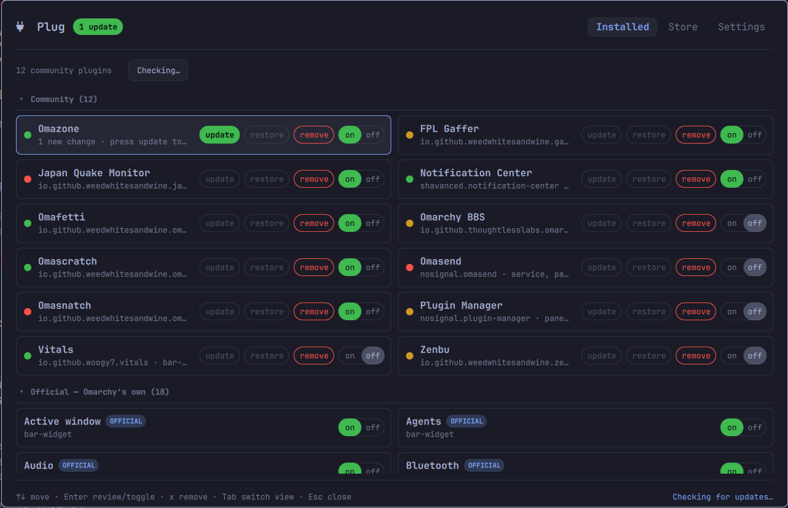

# Plug

**Manage all your plugins, catch every update, and have AI scan the code BEFORE you update or install.**



Plugins run as you, with no sandbox. A plugin you install is code you have not
read, and an update is more of it. Plug manages your installed community plugins
— toggle, remove, browse and install more — and puts the same gate in front of
both moments: before a plugin is installed, and before an update is applied, an
AI reviewer of your choice reads the actual code and tells you, in plain
English, whether it is safe.

## What it does

- **Installed** — every community plugin you have, each row with the same four
  controls in the same place: **update**, **restore**, **remove** and an
  **on/off** switch. The update control lights **green** the moment the
  plugin's repository has moved past what you installed; restore lights up once
  Plug has applied an update it can undo. Laid out two-up to save space, with a
  folded **Official** section for Omarchy's own optional bar widgets — those
  show just the on/off switch, lined up with the community rows (a built-in is
  part of Omarchy, not an installed copy, so there is nothing to update or
  remove).
- **The trust dot** on each row is a quick capability read of the plugin's
  source: what it can reach, run and write. It scores code that runs. Comments
  are ignored, as is text the plugin displays, and a command quoted for you to
  copy yourself counts far more lightly than one the plugin runs itself. A long
  line counts as packed or encoded content only when nothing breaks it up.
- **Review an update** — Plug fetches the exact changes, runs a fast offline
  scan, and hands the diff to your chosen AI reviewer (read-only). You get a
  **safe / be careful / do not** verdict, a plain-English summary of what
  changed, anything to watch for, and the author's own commit notes — then you
  decide. It also judges the update the way the marketplace's own approval
  checks do (new privileges, downloads, network hosts, background processes, or
  writes outside the plugin). The reviewer is told which question it is
  answering — a first install, or a change to something already installed.
- **Restore** — undo the last update you applied, returning the plugin to the
  version it was on before. Plug then flags the update as available again, so
  nothing is lost — you can re-apply it whenever you are ready.
- **Store** — search the community marketplace, and **read a plugin before you
  install it**. Pressing install does not install: Plug clones the plugin to a
  throwaway directory, scans what it can do, has your reviewer read the whole
  source, and tells you plainly whether it looks safe — then you decide, with
  the button reading **Install anyway** if the answer was no. The copy is
  deleted either way, and nothing in it is ever run. Double-click a row to open
  the plugin's own repository page. Omarchy's built-in plugins appear here too,
  marked **OFFICIAL** and shown for discovery only.

## Choosing your reviewer

The reviewer is entirely your choice, set in **Settings**. Plug offers only the
tools you actually have:

- **Command-line agents** — Claude Code, Codex, or Gemini, if their command is
  installed. Plug runs them once, read-only.
- **Local servers** — Ollama or LM Studio, if they are running. The review is a
  request to `localhost`, so **nothing leaves your machine** — a real LLM review
  that is completely private. Their loaded models are listed automatically.
- **Just the offline scan** — no AI at all; Plug reports what its own capability
  scan found. Everything stays local.

Interactive apps such as ChatGPT Desktop or Grok Bot are not offered: they are
windows, not something Plug can call for a one-shot review.

Authentication belongs to the reviewer you chose: Plug runs its command, and
that command uses the sign-in it already has. With Claude Code, that is the
Claude account set up in your terminal. If the tool is not signed in, the review
falls back to the offline scan.

**Privacy.** A cloud agent (Claude, Codex, Gemini) is sent the code it is asked
to judge, and only then: the diff when you review an update, the plugin's full
source when you check one before installing it. That code is public and comes
from a public repository, but it does leave your machine. A local server (Ollama,
LM Studio) or the offline scan keeps everything on it.

## Install

```
omarchy plugin add https://github.com/weedwhitesandwine/plug.git --enable
```

Open it from the bar icon, or from a terminal:

```
omarchy-shell shell toggle io.github.weedwhitesandwine.plug
```

A hotkey is **off by default** — set one in Settings if you want. Plug checks
every shortcut Hyprland is actually using (including Omarchy's own, which are
not in `bindings.lua`) and refuses a combination that is already taken.

## Update

```
omarchy plugin update io.github.weedwhitesandwine.plug --yes
```

## Remove

Hide the bar icon and clear the hotkey in Settings first (that removes Plug's
entry from `shell.json` and its block from `bindings.lua`), then:

```
omarchy plugin remove io.github.weedwhitesandwine.plug
```

Its state is left in `~/.local/state/plug/`, which you can delete.

## What it runs, reads and writes

**Its own state**, all inside `~/.local/state/plug/`: `state.json` (git and
scan results per plugin), `catalog.json` (the marketplace catalog, cached),
`settings.json` (your choices), `locks.json` (restore bookkeeping — which
version each applied update came from).

**Outside its own directory** — only in response to something you do:

| Path | When |
|---|---|
| `~/.config/hypr/bindings.lua` | only when you set or clear a hotkey, and only Plug's own marked block, between `-- >>> plug hotkey` and `-- <<< plug hotkey` |
| `~/.config/omarchy/shell.json` | only when you show or hide the bar icon, and only Plug's own `{"id": …}` entry |
| a plugin's own checkout under `~/.config/omarchy/plugins/…` | standard git operations (`fetch`, fast-forward, and `reset` for a revert) when you update or roll back **that** plugin |
| a temporary directory | a shallow clone of a plugin you asked Plug to check before installing, read and then deleted |

**Commands it runs:** `omarchy-shell shell listPlugins` / `listShellConfig` /
`setPluginEnabled` (read the list and your shell config; enable/disable on your
click); `omarchy-restart-shell` (only after you apply an update or a restore —
see below — and never while the screen is locked) with `omarchy-shell shell
ping` / `summon` to bring Plug back afterwards with the result;
`omarchy plugin add` / `remove` (install/uninstall on your click); `git` inside each plugin's checkout (read its
state, fetch updates, show the diff, apply or revert); `hyprctl binds` (read
active shortcuts) and `hyprctl reload` (after a hotkey change); `python3` (Plug's
own engine); `bash` (Plug's own `plug-ctl.sh`); and the AI reviewer you chose —
either its command (`claude` / `codex` / `gemini`) or a request to a local
server on `localhost`.

**Network:** each installed plugin's git remote, to check for and fetch updates;
the repository of a store plugin you ask Plug to check before installing;
the marketplace catalog on `raw.githubusercontent.com`; and, when you review an
update with a cloud agent, that provider — never otherwise. A local-server
reviewer stays on `localhost`.

**Restarting the shell.** Applying an update or a restore ends with a shell
restart, because that is what makes changed plugin code take effect: the running
shell keeps the copy it loaded at startup, and a plugin rescan refreshes only
which plugins exist, not their code. Your windows and workspaces are untouched;
the bar and the panels reload. Nothing else Plug does restarts anything.

**Timers and background work:** none that runs on its own. The jobs you start —
install, remove, update, restore, on/off — outlive Plug's own window, since the
reload that finishes them also closes it. Each one ends by reopening Plug on the
plugin it acted on and telling you what happened.

Everything runs as your own user.

## Handling untrusted input

A plugin's repository, the marketplace catalog, the update diff and the source
of a plugin you are considering all come from outside, and Plug runs inside a
shell process that stays up for days, so all of it is treated as data:

- Every file Plug reads is read to a size ceiling, following a symlink only to a
  real regular file, so an oversized or redirected file cannot be pulled whole
  into the shell or hang it.
- Every file Plug writes is staged under an exclusively-created name in a
  directory it has verified it owns, then renamed into place, so a symlink left
  at one of those names is never written through.
- A hotkey is validated against a fixed shape in both the settings view and the
  helper script, and refused rather than escaped, because it becomes Lua source
  in `bindings.lua`.
- The AI reviewer is run **structurally read-only** — no tools, in an empty
  working directory — so a prompt-injection hidden in an update's diff, or in
  the source of a plugin being checked, has nothing to act on. It is data the
  reviewer reads, never instructions it follows.
- `git` runs against each untrusted checkout with the repository's own hooks and
  config disabled, so inspecting a plugin can never run code from it.
- A repository address is checked against a plain `https` shape before git is
  ever pointed at it, and passed as an argument rather than through a shell, so
  a catalog entry cannot name a local path or another protocol.
- A plugin you ask Plug to check before installing is cloned shallow into a
  throwaway directory, read, and deleted — whether the check succeeds or not.
  Nothing in it is executed at any point.

## Dependencies

`git`, `python3`, `bash` and `hyprctl`, all of which Omarchy already provides.
An AI reviewer is optional — without one, Plug uses its offline scan.

## Licence

MIT — see [LICENSE](LICENSE).

## Credits

Built with [Claude Code](https://claude.com/claude-code).
